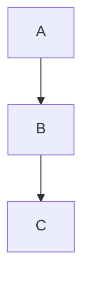

# midori.nvim

Reader-only markdown viewer for Neovim, inspired by [leaf](https://leaf.rivolink.mg).

Open the current markdown buffer in a dedicated read-only window where headings,
inline decorations and fenced code blocks are rendered "nicely" — no conceal hacks,
no rewriting of the source buffer.

## Features

- Line-based parser, zero runtime dependencies
- Decoration via extmarks (markers like `**bold**` and `` `code` `` are stripped from the visible text)
- **Document header bar** — filename + `[ft]` tag at the top of the reader
- Headings H1–H6 with per-level color, **H1 / H2 get a horizontal underline rule**
- Lists, **task lists** (☐/☑), blockquotes, horizontal rules
- **Inline links** rendered as `text ↗` (URLs hidden) and **images** as `[image: alt — path]`
- **Tables** with box-drawing borders and per-column alignment
- **YAML frontmatter** rendered as a title card at the top
- Fenced code blocks with frame, language label and line numbers
- **Treesitter syntax highlighting** inside code blocks
- **Mermaid graph rendering** via [`mermaid-ascii`](https://github.com/AlexanderGrooff/mermaid-ascii)
- **TOC sidebar** (`:MidoriToc`) — heading list with jump-on-`<CR>`
- **Watch mode** — re-renders the reader on `:w`
- Reader window mode: `vsplit` (default) / `full` (new tabpage) / `float`
- `q` to close the reader, `gx` to open the link under cursor

## Requirements

- Neovim 0.10+
- For code syntax highlighting (optional): the relevant treesitter parsers
  installed in your runtimepath (e.g. via `nvim-treesitter`)
- For mermaid (optional): `mermaid-ascii` on `$PATH`

## Install (lazy.nvim)

```lua
{
  "mitubaEX/midori.nvim",
  ft = "markdown",
  cmd = { "MidoriView", "MidoriToggle", "MidoriClose", "MidoriToc", "MidoriRefresh" },
  opts = {},
}
```

Or as a local clone:

```lua
{ dir = "~/ghq/github.com/mitubaEX/midori.nvim", ft = "markdown", opts = {} }
```

## Usage

| Command           | Description                                       |
| ----------------- | ------------------------------------------------- |
| `:MidoriView`     | Open the reader for the current buffer            |
| `:MidoriClose`    | Close the reader                                  |
| `:MidoriToggle`   | Toggle the reader                                 |
| `:MidoriToc`      | Open a heading-list sidebar to the left           |
| `:MidoriRefresh`  | Re-render the reader from the current source      |

Inside the reader buffer:

- `q` — close
- `gx` — open the URL under the cursor (`vim.ui.open`)

Inside the TOC sidebar:

- `q` — close the TOC (the reader stays open)
- `<CR>` — jump the reader to the heading on the current line

## Configuration

`setup()` is called with the defaults below; pass an override table to change any of them.

```lua
require("midori").setup({
  -- "vsplit" (default) | "full" (open in a new tabpage) | "float"
  window = "vsplit",
  -- only used when window = "float"
  width = 0.6,
  height = 0.85,

  heading = {
    -- prefix glyph per level (1..6). Empty strings = color-only headings,
    -- which matches the leaf-style preview look. Set non-empty values to
    -- bring back the ▌▍▎ glyphs.
    icons = { "", "", "", "", "", "" },
    -- horizontal-rule character per level. Set "" to disable for a level.
    rules = { "━", "─", "", "", "", "" },
  },

  code = {
    border       = true,
    line_numbers = true,
    -- treesitter syntax highlighting inside fenced code blocks
    syntax       = true,
  },

  mermaid = {
    -- enable mermaid-ascii rendering for ```mermaid blocks
    enabled = true,
    -- override the binary; nil = use the one found on $PATH
    bin     = nil,
  },

  watch = {
    -- re-render the reader on the source buffer's BufWritePost
    enabled = true,
  },

  rule_width = 60,
})
```

## Highlight groups

All groups are defined with `default = true` and linked to common groups so your
colorscheme applies automatically. Override with `vim.api.nvim_set_hl(0, ...)`.

| Group               | Default link |
| ------------------- | ------------ |
| `MidoriH1`–`MidoriH2` | `Title`    |
| `MidoriH3`–`MidoriH4` | `Function` |
| `MidoriH5`–`MidoriH6` | `Identifier` |
| `MidoriBold`        | `(bold)`     |
| `MidoriItalic`      | `(italic)`   |
| `MidoriStrike`      | `(strikethrough)` |
| `MidoriInlineCode`  | `String`     |
| `MidoriCodeBlock`   | `CursorLine` |
| `MidoriCodeBorder`  | `Comment`    |
| `MidoriCodeLang`    | `Special`    |
| `MidoriCodeLineNr`  | `LineNr`     |
| `MidoriBullet`      | `Special`    |
| `MidoriQuote`       | `Comment`    |
| `MidoriQuoteBar`    | `Special`    |
| `MidoriRule`        | `NonText`    |
| `MidoriH1Rule`      | `Title`      |
| `MidoriH2Rule`      | `Comment`    |
| `MidoriDocTitle`    | `Title`      |
| `MidoriDocFt`       | `Special`    |
| `MidoriTableBorder` | `Comment`    |
| `MidoriTableHeader` | `Title`      |
| `MidoriTableCell`   | `Normal`     |
| `MidoriTaskOpen`    | `Special`    |
| `MidoriTaskDone`    | `Comment`    |
| `MidoriTaskDoneText` | `Comment`   |
| `MidoriLink`        | `Underlined` |
| `MidoriLinkIcon`    | `Special`    |
| `MidoriFrontmatter` | `Comment`    |
| `MidoriFrontmatterKey` | `Identifier` |
| `MidoriTocHeading`  | `Special`    |

## Mermaid

When a fence is tagged `mermaid` and `mermaid-ascii` is installed, the block is
rendered as ASCII art:

````markdown

````

If the binary is missing, midori emits a one-shot `vim.notify` warning and shows
a placeholder block instead of erroring.

Install `mermaid-ascii`:

```sh
go install github.com/AlexanderGrooff/mermaid-ascii@latest
```

## Development

```sh
bash tests/run.sh   # luac -p + stylua --check + nvim --headless behavior
```

The behavior suite intentionally avoids Lua test frameworks; it shells out to
`nvim --headless -l tests/behavior.lua` and exits non-zero on any failed assert.

## License

MIT (see `LICENSE` once added).
